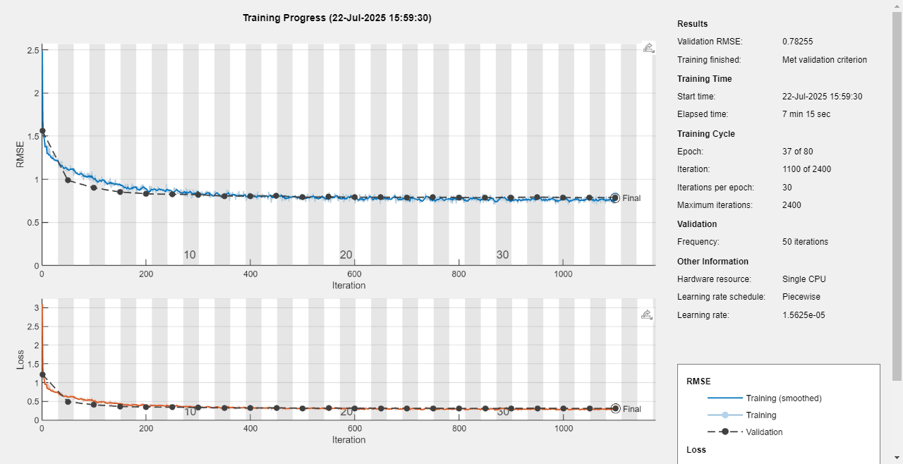
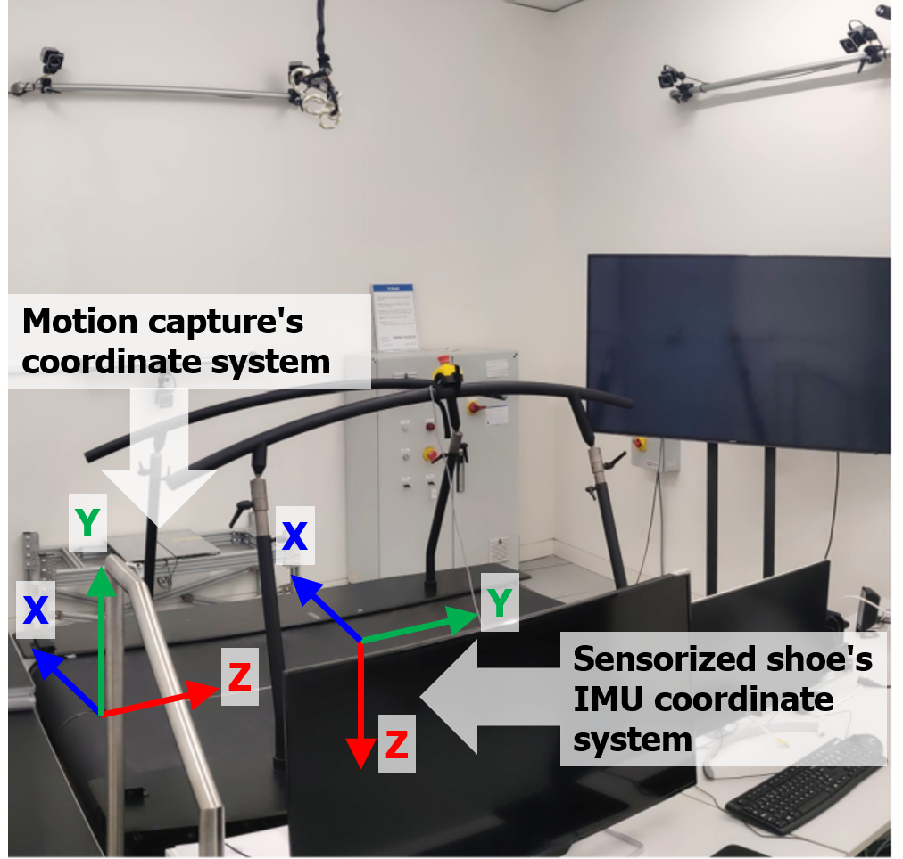
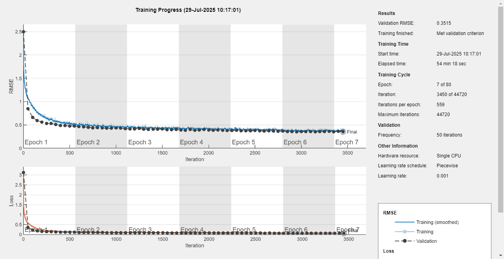
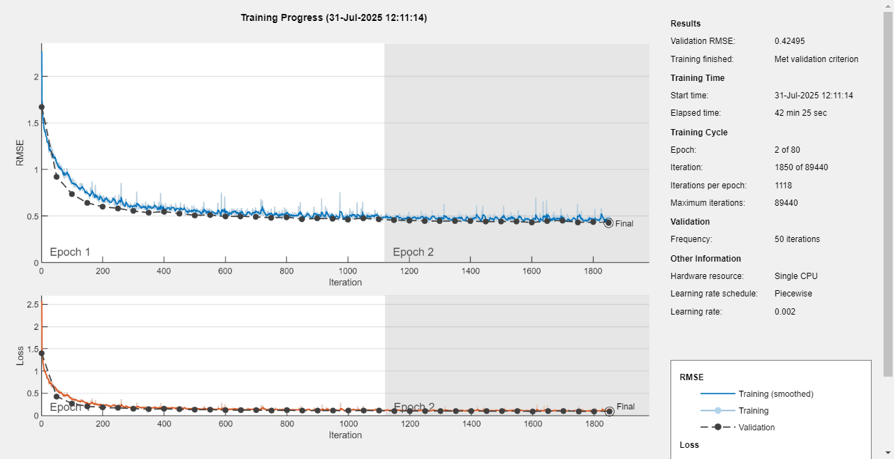
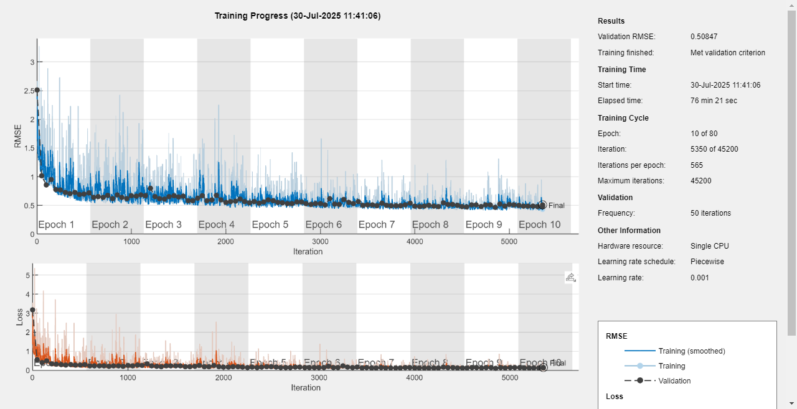
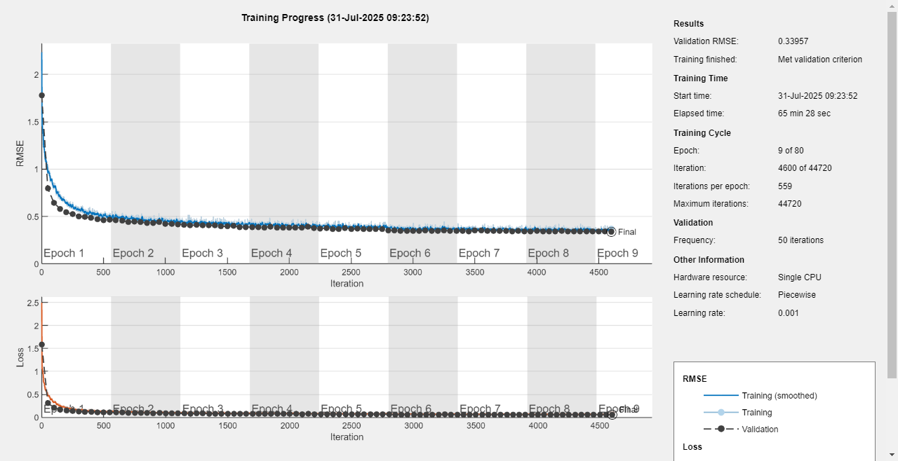
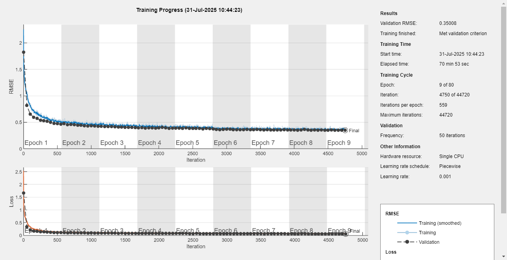

# Log of Toe Clearance Estimation Model


## to 14-Jul-2025
1. These are some information missing in the `.mat` dataset, such as `hs_r_time`，`shokac_starting_time`, `time_diff`, and `Timesteps`, which are necessary in the model training. So, a script, `DataExtraProcessing_xwt.m`, was write to supplement these information into the old dataset.  
    But, note that there are two files in the folder `S1-->ShoeData` that have a wrong name, misspelled 'in' as 'n'. Thus, the script prompts errors when processing the two files. Just revise the name and the script will be ok to these files.

2. Some changes were made to the script `ReadingShoeDataTrainingModels_Xiaowei.m`, the result convergence can be achieved, but some fine tuning is still required, and I will try some different model parameters these days. There are some notes about the script (not the all, see the new script for all changes please):

  - 2.1 
    ```matlab
    shokac_time = results.(subjects{i}).ShokacData.(experiment_name).time(k+window) - ...
                  results.(subjects{i}).ShokacData.(experiment_name).time(1);
    ```
    the `time(k+window)` should be `time(k : k+window)`.

  - 2.2
    ```matlab
    eq_vicon_time = shokac_time + results.(subjects{i}).ShokacData.(experiment_name).time_diff;
    ```
    the `+` sign may should be `-` sign.

  - 2.3  
    If there is a frame of the `y` data containing a `NaN` element, the whole frame should be removed, and also the corresponding frame in the `x` data should also be removed.

  - 2.4
    
    Some parameters and structure of the model were modified to improve the convergence and accuracy, but fine tuning may still be required.

  - 2.5  
    I don't know the meaning of `masked_data`. Only S1 dataset has the `masked_data` (all elements are value `1`), and I cannot parse it. So, I cannot supplement this information into the other subjests' dataset using the customized script `DataExtraProcessing_xwt.m`. So, I just removed it during the training process.

3. These may be some more directly related information connected with the toe clearance, such as the placement position of IMU, foot length, acc, gyro, and foot orientation angles. These information may help improve the model accuracy. I do not know if the foot pressure under the thumb, little, and heel has relations with the toe clearance.  
   Morever, the pipelien of using Pedestrian Dead Reckoning (PDR) and Zero Velocity Update (ZUPT) algorithms can estimate the 3D position and 3D orientation of the IMU placed on the human foot, using only one IMU sensor. But, it just estimates the 6D trajectory of the IMU, not exactly the information of the toe segment.


## to 22-Jul-2025
1. The most relevant info to estimate toe clearance includes: (1) 3D foot orientation angle, (2) 3D linear acceleration, (3) absoluate time (for integral), (4) foot length and the position of IMU on the foot, and (5) treadmill inclination.  
   Thinking that the treadmill speed or walking on a treadmill only has an impact on the foot position estimation on the treadmill surface plane (left-right, forward-backward), which means that the toe clearance will not be affected by the treadmill speed itself.

2. I checked the time alignment between GRF and shoe data. They are mostly aligned, but the shoe data are a little instable.

3. I added the stance & swing phase informaton into the input dataset, which however did not improve the training results. Using only phase information gave worse results compared to using only pressure data, which might be right since stance phase does not mean that there will not be a change in the toe clearance value.

4. Toe clearance may should be the Marker `MTP1 Y-axis` value, but the toe clearance in the old dataset do not match the `MTP1_Y` value. Have no idea which one is incorrect. Also, the old dataset sometimes contains negative toe clearance values, which does not make sense.  
I tried using the `MTP1_Y` value (after subtracting the minimum to avoid negative elements) as the true toe clearance for training, but the training results become worser.  
   **Reply**: The reference toe clearance is not exactly the `MTP1 Y-axis` value, since the shoe shape has to be considered to obtain exactly the toe cleance. The marker `MTP1` measures the shoe clearance, not the toe segment. So, it was a hard work to calculate the reference toe clearance.

5. How is the toe clearance defined when the treadmill has a inclination? Is the perpendicular distance between the toe point against the treadmill surface? In the old dataset, toe clearance values increase during the stance phase, which seems incorrect. It should likely decrease.    
   **Reply**: Yes. It is the perpendicular distance.

6. The model training has a relative better results when only using dataset collected under zero inclination conditions (might indicate the issues in the toe clearance calculation for inclined surfaces).  
   **Reply**: No. Not the reference toe clearance calculation's fault. It is possibly because the lack of gyro or angle information in the dimensions expect sagittal plane, so as the measured body frame-based acc data are not suitable anymore to estimate the abosulte trajectories.

7. I have tried different scale factors and model parameters. Up to now, the best results (both training and final test errors are around 10 mm) appear when using the combination below (using only zero-inclination dataset): (1) unnormalized time, (2) unnormalized acc in unit of m/s2, (3) unnormalized gyro in unit of deg/s, (4) unnormalized treadmill inclination in unit of deg, (5) unnormalized shoe size in unit of m, and (6) normalized foot pressure.

8. Questions:
  - 8.1 Can 3D gyro or, more directly, 3D orientation angle be achieved via the Delsys sensors?  
    **Reply**: Yes, but we want to use the data from the shoe only, so as to buid a portable system in the future.
  
  - 8.2 How are the reference toe clearance values calculated? especially when there is a treadmill inclination.  
    **Reply**: As replied before. The calculation is correct.

9. Should the grf data from shoes have a very high accuracy? I mean if it is necessary to reduce the offset of the grf data. Actually, in physics, I don't think the pressure data play a important role in toe clearance estimation.  
   **Reply**: Maybe more accurate and more detailed grf data can help the model become better, but we dont know. Actually, the grf data are mainly used to separate the stance and swing phases.

10. using logic value for pressure data, to verify that the pressure data value dont need to be so accurate. I know that there are some offset in the collected grf data but that may have no effects on the estimation accuracy. (Threshld is set at 0.5 to convert force to logic values; this pipeline shows better results)

11. filter tc (3rd order butterworth, Fs 100Hz, Fc 15Hz; filtered data lead to better results)

12. Verify the correctness of the baseline toe clearance.  
    **Reply**: The current baseline toe clearances are correct, the difference in lowest value from different subjects is due to the deformation of the shoe becuase of different weight of subjects.


13. 3d angle data are necessary, especially when the acc data are presented in the body coordiante system; otherwise, the 3d angle data are not required here. (at least that there are 3d angle or grf data to help distinguish the stance or swing phase so as to know when the toe clearance is zero.)  
    **Reply**: Not sure the frame that the acc data are represented in. We don't have 3d angle data currently from shoe. just a try of creating a new model, whose inputs are shoe data and outputs are the 3d angle data culculated from marker data. double models.

14. The gyro data from different axes have the same value. It is the fault of the sensor itself. But the 3d gyro data, or angle data, are pretty necessary to transform the acc data from the body frame to the global frame.

**The latest results are as follows:**

please see the matlab code version at 23-Jul-2025.



**Next Steps:**  
1. try to reduce offset in grf data to make them more accurate, so we expect that the model can learn some infor from the accurate grf.
2. try to confirm the frame that the acc data are represented in, body-based or world-based.
3. try to parse foot 3d angles from marker data and regard them as input data to test the accuracy. And then, trying to build a new model to predict 3d angles (not sure will have a good estimation). Maybe when we have 3d angles, the input dataset of collected in inclination will also produce a good results of training.
4. read the *Scientific Report* paper.


## to 29-Jul-2025
1. There is a trend that z axis acc value decreased and the y axis acc value increased when the inclination changed from zero to a non-zero value. And from the perspective of IMU itself, it essentially measures acc in the body frame. If acc in world frame is request, there must be an in-built algorithm embeded in the IMU sensor to transform the coordinate systems for acc data and this transformation must rely on 3D angles (if it is, the IMU should be able to output 3D angles).  
   **So, I think the acc measurement should be represented in the body-based coordinate system. Thereby, 3D angles are still required as input to the model so as to better estimate toe clearance.**

2. It's hard to estimate shoe imu 3D orientation. Even though I can build a foot coordinate frame based on three markers, MTP1, MTP5, as well as Heel, the relation of the marker-based frame with the shoe imu frame cannot be known. I tried to build the marker-baesd frame (x-axis: MTP1-to-MTP5; z-axis: norminal vector of the plane that is constructed using the vector#1 (heel marker to the middle point of MTP1-MTP5) and the vector#2 x-axis; y is obtained from the cross-product of x-axis and z-axis), and calculate the relative orientation angle between this frame and the vicon world frame. And then, transform this relative angle to the IMU original frame, as depicted below.



   **Results: The IMU 3D orientation angles might have been accurately estimated based on Marker data, as provided in** `calc3DIMUOrientation.m`.

3. Adding the 3D orientation angles considerably improve the model outcome. Moreover, including the data collected with non-zero treadmill inclication also help improves the outcome possibly due to the increased amount of training data. The results are given below:

   Train RMSE = 3.2271 mm  
   Train R2 = 0.9653  
   Train Bias = -0.05 mm  
   Train 95CI = [-6.37 mm, 6.28 mm]  
   Validation RMSE = 5.8550 mm  
   Validation R2 = 0.8731  
   Validation Bias = 0.73 mm  
   Validation 95CI = [-10.65 mm, 12.12 mm]



4. Both side of data were used, so the amount of dataset has doubled, results (the same configuration with above) are as follows:  
    Train RMSE = 4.0920 mm  
    Train R2 = 0.9460  
    Train Bias = -0.20 mm  
    Train LoA = [-8.21 mm, 7.81 mm]  
    Validation RMSE = 6.2310 mm  
    Validation R2 = 0.8737  
    Validation Bias = -0.25 mm  
    Validation LoA = [-12.45 mm, 11.96 mm]  




## to latest
1. Adding the edge case data makes the model outcome worse (S1 validation; S2-S10 train and test), as follows:  
    Train RMSE = 4.4024 mm  
    Train R2 = 0.9442  
    Train Bias = -0.04 mm  
    Train LoA = [-8.67 mm, 8.59 mm]  
    Validation RMSE = 7.5906 mm  
    Validation R2 = 0.7867  
    Validation Bias = 1.08 mm  
    Validation LoA = [-13.64 mm, 15.81 mm]



2. Using the calibrated shoe grf (zero the forces during swing phase) as the model input (real value, not logic value; without edge case data), obtains the results as follows:  
    Train RMSE = 3.0697 mm  
    Train R2 = 0.9686  
    Train Bias = -0.07 mm  
    Train 95CI = [-6.09 mm, 5.94 mm]  
    Validation RMSE = 5.5402 mm  
    Validation R2 = 0.8862  
    Validation Bias = 1.02 mm  
    Validation 95CI = [-9.65 mm, 11.70 mm]  



3. the same configuration with the above, only the calibrated shoe grfs are converted into logic values (0.5N or 0.5Nm threshold):  
    Train RMSE = 3.1349 mm  
    Train R2 = 0.9672  
    Train Bias = -0.02 mm  
    Train 95CI = [-6.16 mm, 6.12 mm]  
    Validation RMSE = 5.6893 mm  
    Validation R2 = 0.8800  
    Validation Bias = 1.12 mm  
    Validation 95CI = [-9.82 mm, 12.05 mm]  



4. Leave-one-subject-out results of each subject as the validation and the remaining nine subjects as the training and test (without including edge case data; using the new version of code [01-Aug-2025]):

|Validation Subject|S1|S2|S3|S4|S5|S6|S7|S8|S9|S10|
|:---|---:|---:|---:|---:|---:|---:|---:|---:|---:|---:|
|Train RMSE /mm|2.3554|2.2950|2.5872|2.6026|2.7469|2.3812|2.1220|2.2416|2.7126|2.2487|
|Train R2|0.9815|0.9821|0.9777|0.9775|0.9755|0.9810|0.9852|0.9826|0.9756|0.9822|
|Train Bias /mm|-0.06|0.00|-0.13|0.00|-0.17|0.01|0.04|0.07|-0.03|0.00|
|Train 95CI /mm|[-4.67, 4.56]|[-4.50, 4.49]|[-5.19, 4.94]|[-5.10, 5.11]|[-5.55, 5.20]|[-4.66, 4.67]|[-4.12, 4.20]|[-4.33, 4.46]|[-5.34, 5.29]|[-4.41, 4.41]|
|Validation RMSE /mm|4.8271|3.9953|6.0547|3.7665|4.9172|5.7753|3.6737|4.9109|4.4955|5.5455|
|Validation R2|0.9136|0.9495|0.8667|0.9483|0.8754|0.8858|0.9461|0.9381|0.9246|0.9240|
|Validation Bias /mm|0.52|-1.94|2.44|-0.88|-1.03|1.29|-1.06|-0.90|2.46|1.98|
|Validation 95CI /mm|[-8.88, 9.93]|[-8.79, 4.90]|[-8.43, 13.30]|[-8.06, 6.29]|[-10.46, 8.39]|[-9.74, 12.32]|[-7.95, 5.84]|[-10.36, 8.56]|[-4.91, 9.83]|[-8.17, 12.13]|
|Training Duration /min|263|277|174|222|220|264|410|286|203|333|

5. Changing the scale_y to 0.02, adding the magnitude of the Shokac GRFs in the training (not just the booleans), and making the first layer of the network a 'bilstm' layer:  
	Train RMSE = 2.2845 mm  
	Train R2 = ...  
	Train Bias = ...  
	Train 95CI = ...  
	Validation RMSE = 4.6970 mm  
	Validation R2 = 0.9182  
	Validation Bias = 0.58 mm  
	Validation 95CI = [-8.55 mm, 9.72 mm]  
